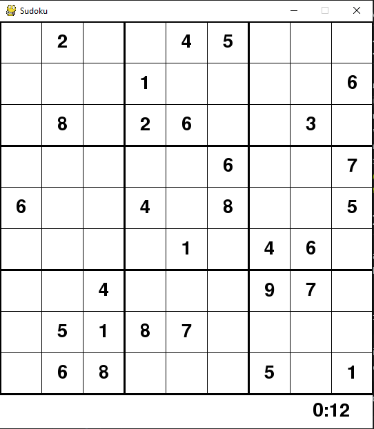

# Sudoku

This is a sudoku GUI written in python using the pygame library. The GUI can show how the backtracking algorithm works and you are also able to play the sudoku. I refered to tech with tim videos for this project. https://www.youtube.com/watch?v=eqUwSA0xI-s

## Setup
This program requires the pygame library and it can be installed by running
```
$ pip install pygame
```

Once the library is installed, run the main.py file
```
$ python main.py
```
The GUI will appear as shown



# Game

To see the backtracking visualisation, press the `space bar`


To play normally,
- select any empty positions
- press the number of your choice, it will be displayed at the side (pencil)
- press `enter` to confirm your choice, a message will be displayed if the number is incorrect
- press `backspace` to delete your pencil number, numbers that are confirmed cannot be deleted